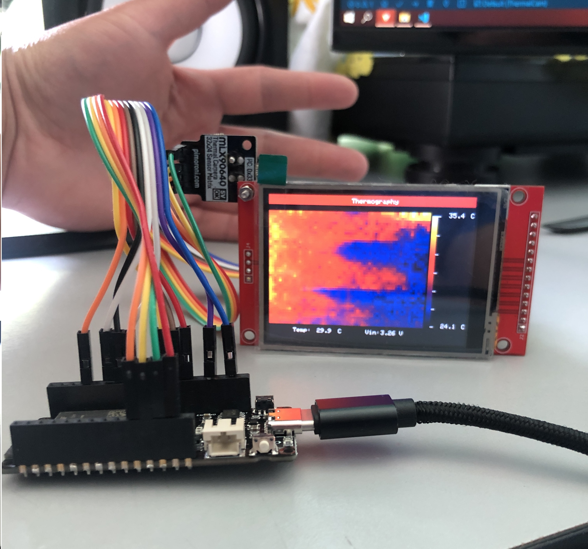

# ESP32_ThermalCam

A simple thermal camera based on the MLX90640 and ESP32, using a TFT display with ILI9341 driver.
This fork incorporates some changes:
* A bilinear interpolation was added to obtain a 64x48 pixel image.
* Added comments to the MLX90640 libraries.
* Displayed MLX90640 sensor configuration and status parameters at program startup on the screen.

Inspired and partially used code from:
* http://stoppi-homemade-physics.de/waermebildkamera/
* https://github.com/sparkfun/SparkFun_MLX90640_Arduino_Example
